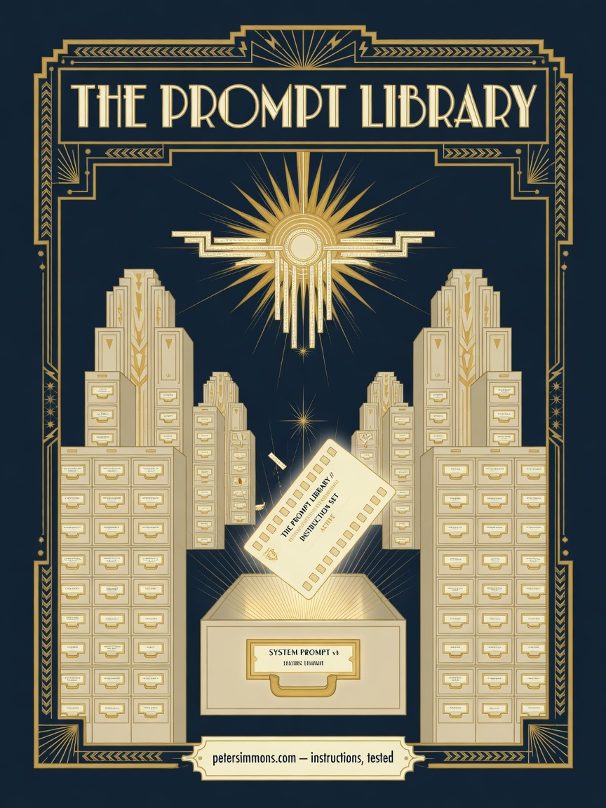

# Art Showcase

Original artwork created for this project and its sibling publications —
generated by Grok from briefs designed in-house, in the house Art Deco styles.

| Piece | Description |
|-------|-------------|
|  | **The Prompt Library** (2026-07-10) — the repo's signature piece. A machine-age archive: card-catalog skyscrapers of brass-handled drawers, a single luminous punched card rising from the open SYSTEM PROMPT drawer under a Deco sunburst. Gold #D4AF37 / navy #0D1117 / cream #F5E6C8. |

A full gallery of all house artwork is planned at **art.petersimmons.com**.
